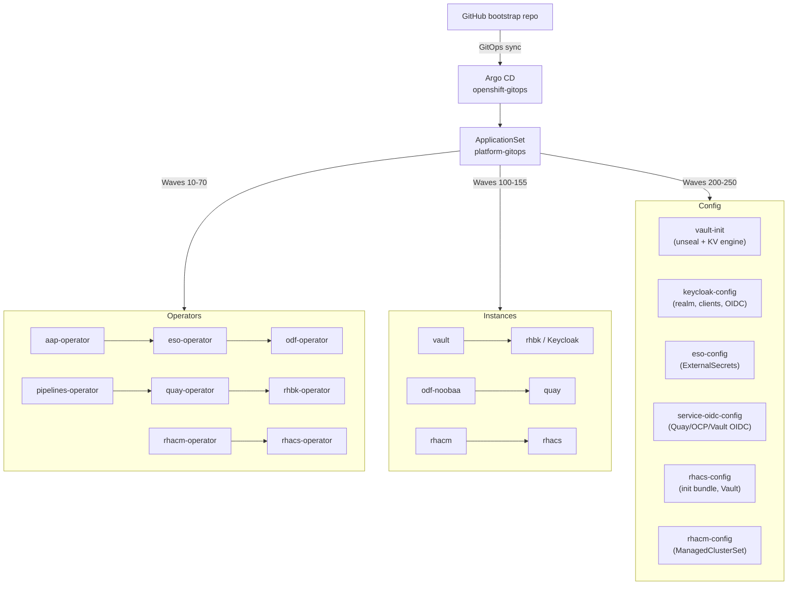

# Hybrid Sovereign Cloud Bootstrap

Bootstraps the Hybrid Sovereign Cloud platform on OpenShift / ROSA using **Helm**, **make**, and **Argo CD GitOps**. All cluster state after Phase 1 is driven by the `platform-gitops` ApplicationSet with `selfHeal: true` and `prune: true`.

---

## Architecture overview



---

## Prerequisites

| Requirement | Version |
|-------------|---------|
| OpenShift / ROSA | 4.14+ |
| `oc` CLI | matching cluster version |
| `helm` | 3.14+ (OCI support required) |
| `make` | any |
| `git` + `bash` | any |
| `curl` | any (for Quay API) |

### Environment variables

All environment variables must be set in `~/.bashrc` or exported in your shell before running any `make` commands. No `.env` file is needed when variables are in `~/.bashrc`.

| Variable | Required | Description | Example |
|----------|----------|-------------|---------|
| `OCP_SERVER` | **Yes** | OpenShift API endpoint | `https://api.cluster.example.com:6443` |
| `OCP_USERNAME` | **Yes** | OpenShift admin username | `kubeadmin` |
| `OCP_PASSWORD` | **Yes** | OpenShift admin password | `<password>` |
| `OCI_REGISTRY` | **Yes** | Quay.io organization URL | `https://quay.io/organization/sovereignhybrid` |
| `OCI_REGISTRY_TOKEN` | **Yes** | Quay.io robot account OAuth token | `<token>` |
| `GITHUB_TOKEN` | **Yes** | GitHub PAT for pipeline Git credentials | `ghp_...` |
| `GITHUB_URL` | No | Bootstrap repo URL (optional override) | `https://github.com/<org>/bootstrap.git` |
| `GITHUB_REVISION` | No | Git revision (default: `main`) | `main` |

```bash
# Add to ~/.bashrc:
export OCP_SERVER="https://api.<cluster-domain>:6443"
export OCP_USERNAME="<admin-user>"
export OCP_PASSWORD="<admin-password>"
export OCI_REGISTRY="https://quay.io/organization/sovereignhybrid"
export OCI_REGISTRY_TOKEN="<quay-robot-oauth-token>"
export GITHUB_TOKEN="<github-pat>"
```

> **How to get `OCI_REGISTRY_TOKEN`**: Log in to [quay.io](https://quay.io), go to your organization → Robot Accounts, create a robot with write access, and copy the OAuth token.

### Validate without a cluster

```bash
make validate-helm
```

---

## Phase 1 — Bootstrap GitOps

Installs OpenShift GitOps (cluster-scoped) and configures the Argo CD Git repository secret.

```bash
cd bootstrap/
source .env   # or: set -a && . .env && set +a

make phase1-gitops \
  GITHUB_URL="$GITHUB_URL" \
  GITHUB_TOKEN="$GITHUB_TOKEN"
```

What it does:

1. Logs in to OpenShift (`make login`)
2. Installs the `openshift-gitops` operator (cluster-scoped, all-namespaces)
3. Waits for Argo CD to be ready
4. Creates the `platform-git-repository` Secret in `openshift-gitops`
5. Applies the GitOps instance CR with cluster-admin bindings

---

## Phase 2 — ApplicationSet deployment

Installs the Helm-based ApplicationSet which drives all subsequent platform installs.

```bash
make phase2-applicationset \
  GITHUB_URL="$GITHUB_URL" \
  GITHUB_TOKEN="$GITHUB_TOKEN"
```

What it does:

1. Reads `APPS_DOMAIN` from the cluster (`ingresses.config.openshift.io/cluster`)
2. Runs `helm upgrade --install platform-applicationset` with correct `appsDomain`
3. Argo CD creates one Application per entry in `platform-applicationset/values.yaml`
4. Applications sync in wave order automatically

### Sync wave order

| Waves | Applications |
|-------|-------------|
| 10–70 | Operators: AAP, ESO, ODF, Pipelines, Quay, RHBK, RHACM, RHACS |
| 100–155 | Instances: sovereign-cloud, Vault, AAP, RHBK, Gitea, ODF-NooBaa, Pipelines, Quay, RHACM, RHACS |
| 200–245 | Config: vault-init, keycloak-config, eso-config, service-oidc-config, rhacs-config, rhacm-config |
| 250 | ArgoCD init job |
| 275 | custom-operators-git-creds (ArgoCD org credential template) |
| 280 | custom-operators-pipelines (Tekton pipelines + ImageStreams for 8 custom operators) |
| 285 | custom-operators-applicationset (ArgoCD ApplicationSet for 8 custom operators) |
| 300–340 | Custom operators via custom-operators-appset: plugin-rbac, entity-operator, cloudaws-operator, cloudoso-operator, platformopenshift-operator, team-operator, projects-operator, assignment-operator |
| 250 | argocd-init-job |

---

## One-Command Full Rebuild (brand new cluster)

The entire platform can be deployed with a single command:

```bash
cd bootstrap/
source .env

make rebuild-all \
  GITHUB_URL="$GITHUB_URL" \
  GITHUB_TOKEN="$GITHUB_TOKEN"
```

This runs the following sequence automatically:
1. `phase1-gitops` — install ArgoCD, configure repo
2. `phase2-applicationset` — deploy all operators + instances via ArgoCD ApplicationSet
3. `vault-enable-kv` — ensure Vault `central/` KV engine is enabled
4. `vault-store-gitea-admin` — seed Gitea admin credentials in Vault
5. `keycloak-config` — create `sovereign-tenants` realm, OIDC clients, store in Vault
6. `vault-store-keycloak-auth` — store master-realm admin creds for `plugin_rbac` operator
7. `external-secrets-config` — sync all ExternalSecrets from Vault
8. `deploy-custom-operators` — install custom operator pipelines, git-creds, ApplicationSet

After rebuild, build all 8 custom operator images and deploy:
```bash
make trigger-build-all          # Start 8 parallel Tekton PipelineRuns
make wait-custom-operators      # Wait for all operator pods to be Ready
make sample-crs-apply           # Apply sample CRs to test all operators
make status-custom-operators    # Show full status
```

---

## Post-bootstrap: seed Vault secrets (manual / individual steps)

For individual deployments or troubleshooting, the vault seeding steps can be run independently:

```bash
make vault-enable-kv              # Enable central/ KV engine in Vault
make vault-store-gitea-admin      # Generate and store Gitea admin password
make keycloak-config              # Configure Keycloak realm and OIDC clients
make vault-store-keycloak-auth    # Store KC admin creds for plugin_rbac
make external-secrets-config      # Sync ExternalSecrets
```

---

## Installed components

| Component | Namespace | Description |
|-----------|-----------|-------------|
| OpenShift GitOps (Argo CD) | `openshift-gitops` | GitOps controller |
| HashiCorp Vault | `vault` | Central secrets store |
| External Secrets Operator | `external-secrets-operator` | Vault → K8s secret sync |
| Red Hat build of Keycloak | `rhbk` | OIDC identity provider |
| ODF / NooBaa | `openshift-storage` | S3-compatible object storage |
| Quay Registry | `quay` | Container image registry |
| Gitea | `gitea` | Internal Git server |
| Ansible Automation Platform | `aap` | Automation controller |
| OpenShift Pipelines (Tekton) | `openshift-operators` | CI/CD builds |
| **RHACM** | `open-cluster-management` | Multi-cluster management |
| **RHACS** | `stackrox` | Container security |
| **plugin_rbac** (custom) | `sovereign-cloud-plugins` | Keycloak group RBAC operator |
| **entity-operator** (custom) | `sovereign-cloud` | Entity + Container composition operator |
| **cloudaws-operator** (custom) | `sovereign-cloud` | AWS cloud resource operator |
| **cloudoso-operator** (custom) | `sovereign-cloud` | OpenStack cloud resource operator |
| **platformopenshift-operator** (custom) | `sovereign-cloud` | OCP platform instance operator |
| **team-operator** (custom) | `sovereign-cloud` | Team namespace + RBAC operator |
| **projects-operator** (custom) | `sovereign-cloud` | Project namespace operator |
| **assignment-operator** (custom) | `sovereign-cloud` | App-to-Infra bridge operator |

---

## OIDC integrations

After `service-oidc-config` (wave 230) runs, all three services authenticate via Keycloak:

| Service | Client ID | Callback |
|---------|-----------|---------|
| Quay | `quay-oidc` | `https://<quay-host>/oauth2/keycloak/callback` |
| OpenShift OAuth | `openshift-oidc` | `https://oauth-openshift.<domain>/oauth2callback/Keycloak` |
| Vault | `vault-oidc` | `https://<vault-host>/ui/vault/auth/oidc/oidc/callback` |

---


---

## Useful make targets

```bash
# Cluster setup
make help                         # list all targets
make login                        # oc login with env vars
make validate-helm                # lint all charts (no cluster needed)
make rebuild-all                  # FULL platform rebuild (Phase 1+2+vault+custom ops)

# Status and verification
make status                       # show ArgoCD + Helm release health
make verify-argocd-app-health     # check all apps are Synced+Healthy
make status-custom-operators      # custom operator pods, CRDs, sample CRs

# Vault / Keycloak
make vault-enable-kv              # enable central/ KV engine (idempotent)
make vault-store-gitea-admin      # seed Gitea admin credentials
make vault-store-keycloak-auth    # store KC master-realm creds for plugin_rbac
make keycloak-config              # create realm + OIDC clients

# Custom operators
make trigger-build-all            # build all 8 operator images via Tekton
make trigger-build OPERATOR=cloudaws-operator REPO=CloudAWS  # single build
make wait-custom-operators        # wait for all operator pods
make restart-custom-operators     # rolling restart (picks up new images)
make sample-crs-apply             # apply sample CRs for testing

# Teardown
make teardown-bootstrap           # Helm uninstall all releases
make delete-bootstrap-namespaces  # delete all managed namespaces
```

### Secret flow

```
Vault KV (central/<path>)
  └─▶ ESO ClusterSecretStore
        └─▶ ExternalSecret (per namespace)
              └─▶ Kubernetes Secret
                    └─▶ Application (env var / volume)
```

| Vault Path | Contents | Used By |
|-----------|----------|---------|
| `central/keycloak/sovereign-tenants-client` | Shared OIDC client | sovereign-cloud |
| `central/keycloak/auth-config` | Admin creds for plugin_rbac | sovereign-cloud |
| `central/quay/oidc` | Quay OIDC client | quay |
| `central/openshift/oidc` | OpenShift OAuth OIDC | openshift-config |
| `central/vault/oidc` | Vault OIDC client | vault |
| `central/gitea/admin` | Gitea admin credentials | gitea |
| `central/rhacs/admin` | ACS Central admin + URL | stackrox |
| `central/github/token` | GitHub PAT for Tekton | sovereign-cloud |

---

## RHACM — Multi-cluster management

RHACM is installed at wave 65 (operator) and wave 150 (MultiClusterHub). After the hub is Running:

1. The hub cluster auto-imports as `local-cluster`
2. The `sovereign-cloud-clusters` ManagedClusterSet is created by `rhacm-config`
3. Additional clusters are imported via `ManagedCluster` CR or the RHACM console

```bash
make wait-rhacm-ready
# Then open: https://multicloud-console.apps.<domain>/
```

---

## RHACS — Container security

RHACS is installed at wave 70 (operator) and wave 155 (Central + SecuredCluster). The `rhacs-config` PostSync job:

1. Waits for Central to be `Deployed`
2. Reads the admin password from `central-htpasswd` secret
3. Stores it in Vault at `central/rhacs/admin`
4. Generates an init bundle via the ACS API
5. Applies the bundle to enable Sensor/Collector on the cluster
6. Patches `SecuredCluster.spec.centralEndpoint`
7. PostSync `rhacs-fix-consoleplugin` (wave **15**, after `rhacs-init-bundle` wave **5**): merge-patches `ConsolePlugin/advanced-cluster-security` so `spec.backend.service` targets **`central:443`** in namespace **`stackrox`** with **`basePath: /static/ocp-plugin`** (RHACS `sensor-proxy` rejects unauthenticated `plugin-manifest.json`; Central serves static assets without a bearer token).

```bash
make wait-rhacs-ready
# Then open: https://central-stackrox.apps.<domain>/
make debug-acs-consoleplugin   # read-only: enabled plugins + ConsolePlugin YAML head
make fix-acs-consoleplugin     # same patch as chart job (manual recovery)
```

---

## Teardown

Full teardown removes all Helm-managed resources and namespaces:

```bash
# Step 1: Helm uninstall everything
make teardown-bootstrap

# Step 2: Remove finalizers on RHACM/RHACS if stuck
oc patch multiclusterhub multiclusterhub -n open-cluster-management \
  --type=json -p='[{"op":"remove","path":"/metadata/finalizers"}]' 2>/dev/null || true
oc patch central stackrox-central-services -n stackrox \
  --type=json -p='[{"op":"remove","path":"/metadata/finalizers"}]' 2>/dev/null || true

# Step 3: Delete namespaces
make delete-bootstrap-namespaces

# Step 4: Remove cluster-scoped CRDs (RHACM/RHACS leave CRDs behind)
oc get crd | grep -E 'open-cluster-management|stackrox' | awk '{print $1}' | \
  xargs oc delete crd --ignore-not-found=true 2>/dev/null || true
```

---

## Cursor / Claude agent setup

- Open `bootstrap/` as the workspace root in Cursor.
- Rules in `.cursor/rules/sovereign-cloud.mdc` apply automatically.
- See `AGENTS.md` for the full agent guide.
- See `AI-POLICY.md` for the governance policy.

---

## Repository structure

```
bootstrap/
├── charts/
│   ├── operators/     # OLM Subscription + OperatorGroup per operator
│   ├── instances/     # CR instances (Vault, Keycloak, Quay, RHACM, RHACS …)
│   ├── config/        # PostSync init jobs (vault-init, keycloak-config …)
│   └── gitops/        # ApplicationSet + argocd-init-job
├── Makefile           # All cluster interactions
├── AI-POLICY.md       # AI agent governance
├── AGENTS.md          # Agent guide
└── README.md          # This file
```
