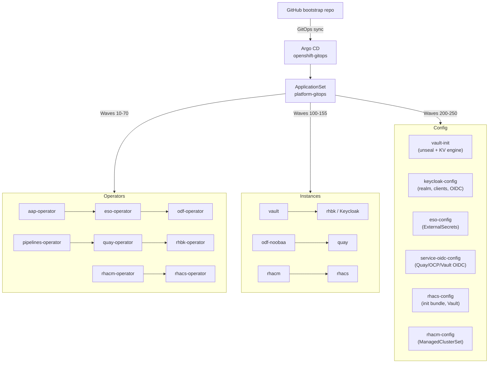

# Hybrid Sovereign Cloud Bootstrap

Bootstraps the Hybrid Sovereign Cloud platform on OpenShift / ROSA using **Helm**, **make**, and **Argo CD GitOps**. All cluster state after Phase 1 is driven by the `platform-gitops` ApplicationSet with `selfHeal: true` and `prune: true`.

---

## Architecture overview



---

## Prerequisites

| Requirement | Version |
|-------------|---------|
| OpenShift / ROSA | 4.14+ |
| `oc` CLI | matching cluster version |
| `helm` | 3.12+ |
| `make` | any |
| `git` + `bash` | any |

### Environment variables

Copy `.env.example` to `.env` and fill in:

```bash
export OCP_SERVER=https://api.<cluster>.<domain>:6443
export OCP_USERNAME=<username>
export OCP_PASSWORD=<password>
export GITHUB_URL=https://github.com/<org>/bootstrap.git
export GITHUB_TOKEN=<personal-access-token>
export GITHUB_REVISION=main   # optional, defaults to main
```

### Validate without a cluster

```bash
make validate-helm
```

---

## Phase 1 — Bootstrap GitOps

Installs OpenShift GitOps (cluster-scoped) and configures the Argo CD Git repository secret.

```bash
cd bootstrap/
source .env   # or: set -a && . .env && set +a

make phase1-gitops \
  GITHUB_URL="$GITHUB_URL" \
  GITHUB_TOKEN="$GITHUB_TOKEN"
```

What it does:

1. Logs in to OpenShift (`make login`)
2. Installs the `openshift-gitops` operator (cluster-scoped, all-namespaces)
3. Waits for Argo CD to be ready
4. Creates the `platform-git-repository` Secret in `openshift-gitops`
5. Applies the GitOps instance CR with cluster-admin bindings

---

## Phase 2 — ApplicationSet deployment

Installs the Helm-based ApplicationSet which drives all subsequent platform installs.

```bash
make phase2-applicationset \
  GITHUB_URL="$GITHUB_URL" \
  GITHUB_TOKEN="$GITHUB_TOKEN"
```

What it does:

1. Reads `APPS_DOMAIN` from the cluster (`ingresses.config.openshift.io/cluster`)
2. Runs `helm upgrade --install platform-applicationset` with correct `appsDomain`
3. Argo CD creates one Application per entry in `platform-applicationset/values.yaml`
4. Applications sync in wave order automatically

### Sync wave order

| Waves | Applications |
|-------|-------------|
| 10–70 | Operators: AAP, ESO, ODF, Pipelines, Quay, RHBK, RHACM, RHACS |
| 100–155 | Instances: sovereign-cloud, Vault, AAP, RHBK, Gitea, ODF-NooBaa, Pipelines, Quay, RHACM, RHACS |
| 200–245 | Config: vault-init, keycloak-config, eso-config, service-oidc-config, rhacs-config, rhacm-config |
| 250 | argocd-init-job |

---

## Post-bootstrap: seed Vault secrets

After `vault-init` completes (wave 200), seed the initial secrets that drive downstream configuration:

```bash
# 1. Get the Vault root token
VAULT_TOKEN=$(oc get secret vault-init-keys -n vault \
  -o jsonpath='{.data.root-token}' | base64 -d)

# 2. Forward Vault port
oc port-forward svc/central-vault -n vault 8200:8200 &

export VAULT_ADDR="http://localhost:8200"
export VAULT_TOKEN

# 3. Seed Keycloak admin credentials (used by keycloak-config job)
vault kv put central/keycloak/admin \
  username="<keycloak-admin-user>" \
  password="<keycloak-admin-password>"

# 4. Seed Gitea admin credentials
vault kv put central/gitea/admin \
  username="<gitea-admin-user>" \
  password="<gitea-admin-password>"
```

---

## Installed components

| Component | Namespace | Description |
|-----------|-----------|-------------|
| OpenShift GitOps (Argo CD) | `openshift-gitops` | GitOps controller |
| HashiCorp Vault | `vault` | Central secrets store |
| External Secrets Operator | `external-secrets-operator` | Vault → K8s secret sync |
| Red Hat build of Keycloak | `rhbk` | OIDC identity provider |
| ODF / NooBaa | `openshift-storage` | S3-compatible object storage |
| Quay Registry | `quay` | Container image registry |
| Gitea | `gitea` | Internal Git server |
| Ansible Automation Platform | `aap` | Automation controller |
| OpenShift Pipelines (Tekton) | `openshift-operators` | CI/CD builds |
| **RHACM** | `open-cluster-management` | Multi-cluster management |
| **RHACS** | `stackrox` | Container security |

---

## OIDC integrations

After `service-oidc-config` (wave 230) runs, all three services authenticate via Keycloak:

| Service | Client ID | Callback |
|---------|-----------|---------|
| Quay | `quay-oidc` | `https://<quay-host>/oauth2/keycloak/callback` |
| OpenShift OAuth | `openshift-oidc` | `https://oauth-openshift.<domain>/oauth2callback/Keycloak` |
| Vault | `vault-oidc` | `https://<vault-host>/ui/vault/auth/oidc/oidc/callback` |

---

## Secret flow

```
Vault KV (central/<path>)
  └─▶ ESO ClusterSecretStore
        └─▶ ExternalSecret (per namespace)
              └─▶ Kubernetes Secret
                    └─▶ Application (env var / volume)
```

Vault paths:

| Path | Contents |
|------|----------|
| `central/keycloak/sovereign-tenants-client` | Shared OIDC client |
| `central/quay/oidc` | Quay OIDC client |
| `central/openshift/oidc` | OpenShift OAuth OIDC client |
| `central/vault/oidc` | Vault OIDC client |
| `central/gitea/admin` | Gitea admin credentials |
| `central/rhacs/admin` | ACS Central admin password + URL |

---

## Useful make targets

```bash
make help                    # list all targets with descriptions
make login                   # oc login with env vars
make validate-helm           # lint all charts (no cluster needed)
make status                  # show Argo CD application health
make verify-argocd-app-health # check all apps are Synced+Healthy
make wait-rhacm-ready        # wait for MultiClusterHub Running
make wait-rhacs-ready        # wait for ACS Central Deployed
make teardown-bootstrap      # Helm uninstall all releases
make delete-bootstrap-namespaces  # delete all managed namespaces
```

---

## RHACM — Multi-cluster management

RHACM is installed at wave 65 (operator) and wave 150 (MultiClusterHub). After the hub is Running:

1. The hub cluster auto-imports as `local-cluster`
2. The `sovereign-cloud-clusters` ManagedClusterSet is created by `rhacm-config`
3. Additional clusters are imported via `ManagedCluster` CR or the RHACM console

```bash
make wait-rhacm-ready
# Then open: https://multicloud-console.apps.<domain>/
```

---

## RHACS — Container security

RHACS is installed at wave 70 (operator) and wave 155 (Central + SecuredCluster). The `rhacs-config` PostSync job:

1. Waits for Central to be `Deployed`
2. Reads the admin password from `central-htpasswd` secret
3. Stores it in Vault at `central/rhacs/admin`
4. Generates an init bundle via the ACS API
5. Applies the bundle to enable Sensor/Collector on the cluster
6. Patches `SecuredCluster.spec.centralEndpoint`

```bash
make wait-rhacs-ready
# Then open: https://central-stackrox.apps.<domain>/
```

---

## Teardown

Full teardown removes all Helm-managed resources and namespaces:

```bash
# Step 1: Helm uninstall everything
make teardown-bootstrap

# Step 2: Remove finalizers on RHACM/RHACS if stuck
oc patch multiclusterhub multiclusterhub -n open-cluster-management \
  --type=json -p='[{"op":"remove","path":"/metadata/finalizers"}]' 2>/dev/null || true
oc patch central stackrox-central-services -n stackrox \
  --type=json -p='[{"op":"remove","path":"/metadata/finalizers"}]' 2>/dev/null || true

# Step 3: Delete namespaces
make delete-bootstrap-namespaces

# Step 4: Remove cluster-scoped CRDs (RHACM/RHACS leave CRDs behind)
oc get crd | grep -E 'open-cluster-management|stackrox' | awk '{print $1}' | \
  xargs oc delete crd --ignore-not-found=true 2>/dev/null || true
```

---

## Cursor / Claude agent setup

- Open `bootstrap/` as the workspace root in Cursor.
- Rules in `.cursor/rules/sovereign-cloud.mdc` apply automatically.
- See `AGENTS.md` for the full agent guide.
- See `AI-POLICY.md` for the governance policy.

---

## Repository structure

```
bootstrap/
├── charts/
│   ├── operators/     # OLM Subscription + OperatorGroup per operator
│   ├── instances/     # CR instances (Vault, Keycloak, Quay, RHACM, RHACS …)
│   ├── config/        # PostSync init jobs (vault-init, keycloak-config …)
│   └── gitops/        # ApplicationSet + argocd-init-job
├── Makefile           # All cluster interactions
├── AI-POLICY.md       # AI agent governance
├── AGENTS.md          # Agent guide
└── README.md          # This file
```
