# Platform Secrets Flow

## Overview

Sovereign Cloud uses **HashiCorp Vault Central** (`vault-central`) as the **single point of truth** for all platform credentials. Vault exposes a **KV v2** secrets engine at mount path `central/`. The **External Secrets Operator** (ESO) on both clusters connects to `vault-central` through `ClusterSecretStore` named `vault-backend`.

### Key Principles

1. **vault-central** is the only vault that stores secrets. vault-services does NOT store any platform secrets.
2. All secrets movement uses **ExternalSecret** (pull) and **PushSecret** (push) — no manual `oc` commands.
3. **Ansible Jobs** (`kind: Job`) are used only for initialization tasks (vault init, gitea init, realm/client creation). Secret storage is delegated to ESO.
4. Unseal keys and root tokens for **both** vault-central and vault-services are stored in vault-central.

---

## Secret Paths in vault-central (`central/data/...`)

| Path | Contents | Source |
|------|----------|--------|
| `central/data/vault-init` | root_token, unseal_keys, unseal_keys_base64 | vault chart PushSecret |
| `central/data/vault-services-init` | root_token, unseal_keys, unseal_keys_base64 | vault-services PushSecret (services cluster) |
| `central/data/rhbk-central-admin` | username, password | rhbk chart PushSecret |
| `central/data/rhbk-services-admin` | username, password | rhbk chart PushSecret |
| `central/data/gitea-admin` | admin_user, admin_password, admin_token | giteaInit PushSecret |
| `central/data/keycloak-clients` | quay-central, vault, gitea, openshift-central | keycloakClients PushSecret |
| `central/data/oci-credentials` | registry, username, password | init chart PushSecret |

---

## Bootstrap Sequence

```
make init-central-argo
       │
       ▼
helm/init deploys to central cluster (openshift-gitops)
  ├─ Creates quay-pull-secret in all central namespaces
  ├─ Creates bootstrap-oci-creds Secret
  ├─ PushSecret: pushes oci-credentials → vault-central
  └─ ApplicationSet → sovereign-central-apps Application
                              │
                              ▼
              helm/central App-of-Apps syncs (waves)
```

---

## Sync Wave Order (App-of-Apps)

```
Wave  1: sovereign-namespaces (central + services)
Wave  3: sovereign-jobs-rbac
Wave 10: rhacm
Wave 12: odf-central, odf-services
Wave 15: vault (central), vault-services (services)
Wave 18: external-secrets (central + services)
Wave 20: rhbk-central, rhbk-services, vault-services-init (separate app)
Wave 23: job-vault-init
Wave 24: job-vault-kv
Wave 25: job-deliver-vault-token
Wave 26: job-keycloak-realms
Wave 27: job-keycloak-groups, job-keycloak-clients, job-keycloak-rbac,
         job-keycloak-oauth, job-gitea-init, job-keycloak-services-realms
Wave 28: vault-secret-store (central + services)
Wave 30: crunchy-postgres-central, crunchy-postgres-services
Wave 35: quay-central, quay-services
Wave 38: entity-operator, team-operator, assignment-operator, project-operator, platformopenshift-operator, cloudoso-operator, sovereign-cloud-dashboard
Wave 39: plugin-rbac
Wave 40: aap-services (controller + gateway + EDA, no hub, no CrunchyPostgres)
```

---

## Secrets Flow Diagram

```mermaid
flowchart TB
    subgraph CENTRAL["Central Cluster"]
        subgraph VAULT_C["vault namespace"]
            VC[("vault-central\nKV: central/")]
            VIS["vault-init-secrets\n(k8s Secret)"]
            VCT_C["vault-central-token\n(k8s Secret)"]
        end

        subgraph GITOPS["openshift-gitops namespace"]
            BOOT["bootstrap-oci-creds\n(k8s Secret)"]
            PS_OCI["PushSecret:\npush-oci-creds-to-vault"]
        end

        subgraph RHBK_C["rhbk namespace"]
            KC["rhbk-central\n(Keycloak)"]
            KC_SECRET["rhbk-central-initial-admin\n(k8s Secret)"]
            PS_KC["PushSecret:\nrhbk-central-admin"]
        end

        subgraph VAULT_SS["vault-secret-store"]
            CSS_C["ClusterSecretStore\nvault-backend\n→ vault-central"]
        end

        subgraph JOBS["sovereign-cloud-jobs namespace"]
            J_VI["Job: vault-init\n(initializes vault-central)"]
            J_VK["Job: vault-kv\n(enables KV engines)"]
            J_DVT["Job: deliver-vault-token\n(creates token on services cluster)"]
            J_KC["Job: keycloak-clients\n(creates Keycloak clients)"]
            KCS["keycloak-client-secrets\n(k8s Secret)"]
            PS_KCS["PushSecret:\npush-keycloak-client-secrets"]
            J_GI["Job: gitea-init"]
            GCS["gitea-credentials\n(k8s Secret)"]
            PS_GI["PushSecret:\npush-gitea-admin"]
        end

        subgraph GITEA_NS["gitea namespace"]
            GITEA["Gitea"]
        end
    end

    subgraph SERVICES["Services Cluster"]
        subgraph VAULT_SVC["vault namespace (services)"]
            VS[("vault-services\n(uninitialized until job runs)")]
            VSIS["vault-services-init-secrets\n(k8s Secret)"]
            J_VSI["Job: vault-services-init\n(in-cluster init)"]
            PS_VSI["PushSecret:\npush-vault-services-init"]
            ES_QPS["ExternalSecret:\noci-pull-secret → quay-pull-secret"]
            VCT_S["vault-central-token\n(k8s Secret)"]
        end

        subgraph VAULT_SS_S["vault-secret-store-services"]
            CSS_S["ClusterSecretStore\nvault-backend\n→ vault-central"]
        end

        subgraph RHBK_S["rhbk namespace"]
            KS["rhbk-services\n(Keycloak)"]
        end

        subgraph AAP_NS["aap namespace"]
            AAP["AAP\n(controller+gateway+EDA)"]
        end

        subgraph SC["sovereign-cloud-plugins namespace"]
            PLUGIN_RBAC["plugin-rbac\noperator"]
        end
    end

    %% Central vault initialization
    J_VI -->|"creates"| VIS
    VIS -->|"PushSecret (vault chart)"| VC
    J_VK -->|"enables KV engine"| VC

    %% OCI credentials to vault-central
    BOOT -->|"PushSecret"| PS_OCI
    PS_OCI -->|"central/data/oci-credentials"| VC

    %% RHBK Central admin to vault-central
    KC --> KC_SECRET
    KC_SECRET -->|"PushSecret"| PS_KC
    PS_KC -->|"central/data/rhbk-central-admin"| VC

    %% Deliver vault token to services cluster
    J_DVT -->|"k8s API"| VCT_S
    VCT_S --> CSS_S
    CSS_S --> ES_QPS

    %% OCI creds to services cluster
    VC -->|"ExternalSecret via CSS_S"| ES_QPS
    ES_QPS -->|"creates"| VAULT_SVC

    %% vault-services init (in-cluster)
    J_VSI -->|"initializes"| VS
    J_VSI -->|"creates"| VSIS
    VSIS -->|"PushSecret via CSS_S"| PS_VSI
    PS_VSI -->|"central/data/vault-services-init"| VC

    %% Keycloak clients secrets
    J_KC -->|"creates"| KCS
    KCS -->|"PushSecret"| PS_KCS
    PS_KCS -->|"central/data/keycloak-clients"| VC

    %% Gitea init
    J_GI -->|"creates"| GCS
    GCS -->|"PushSecret"| PS_GI
    PS_GI -->|"central/data/gitea-admin"| VC

    %% plugin-rbac configured to rhbk-services
    KS -->|"OIDC"| PLUGIN_RBAC
```



---

## Namespace-level Secrets Map

### Central Cluster

```
openshift-gitops
  └── bootstrap-oci-creds → PushSecret → vault-central: central/data/oci-credentials

vault
  ├── vault-init-secrets (created by vault-init job)
  │     └── PushSecret → vault-central: central/data/vault-init
  └── vault-central-token (root token for vault-backend ClusterSecretStore)

rhbk
  ├── rhbk-central-initial-admin (created by Keycloak operator)
  │     └── PushSecret → vault-central: central/data/rhbk-central-admin
  └── [ExternalSecret consumers pull from vault-central as needed]

sovereign-cloud-jobs
  ├── gitea-credentials (created by gitea-init job)
  │     └── PushSecret → vault-central: central/data/gitea-admin
  └── keycloak-client-secrets (created by keycloak-clients job)
        └── PushSecret → vault-central: central/data/keycloak-clients
```

### Services Cluster

```
vault
  ├── vault-central-token (delivered by deliver-vault-token job from central)
  │     └── Used by ClusterSecretStore vault-backend → vault-central
  ├── quay-pull-secret (ExternalSecret ← vault-central: central/data/oci-credentials)
  ├── vault-services-init-secrets (created by in-cluster vault-services-init job)
  │     └── PushSecret → vault-central: central/data/vault-services-init
  └── [ClusterSecretStore vault-backend points to vault-central]

rhbk
  └── rhbk-services-initial-admin (created by Keycloak operator)
        └── PushSecret → vault-central: central/data/rhbk-services-admin
```

---

## vault-services Initialization Flow

vault-services-init is a **separate ArgoCD Application** (chart: `vault-services-init`) that runs in the `vault` namespace on the services cluster. It uses `kubernetes.core.k8s_exec` to run `vault operator init` and `vault operator unseal` commands directly inside the vault pods.

```
Wave 15: vault-services Application deploys (services cluster)
  ├── vault namespace already exists
  ├── vault-services StatefulSet deployed (3 replicas, Raft HA, retry_join)
  ├── ExternalSecret: oci-pull-secret → quay-pull-secret
  └── Pods start Running but uninitialized/sealed

Wave 20: vault-services-init Application deploys (services cluster)
  ├── ServiceAccount: vault-init-runner + RBAC (pods/exec: get+create)
  ├── Job: vault-services-init
  │     ├── Waits for all vault pods to be Running
  │     ├── k8s_exec → vault-services-0: vault operator init -format=json
  │     ├── Stores root_token + unseal_keys as K8s Secret
  │     ├── k8s_exec → unseal vault-services-0 (leader)
  │     ├── k8s_exec → vault-services-1: raft join + unseal
  │     └── k8s_exec → vault-services-2: raft join + unseal
  └── PushSecret: push-vault-services-init-secrets
        └── Pushes root_token + unseal_keys → vault-central: vault-services-init
```

---

## Obsolete / Disabled Items

| Item | Status | Reason |
|------|--------|--------|
| `vaultServicesInit` sovereign-job (central) | DISABLED | Replaced by standalone vault-services-init ArgoCD Application + chart |
| `configure-keycloak.yml` playbook | UNUSED | Replaced by individual keycloak-* jobs |
| `vault-secrets` ansible role | UNUSED | Secrets moved via PushSecret (ESO), no longer via Ansible |
| `rhbkConfig` Application | DEPRECATED | Replaced by individual keycloak-* job Applications |
| AAP hub component | DISABLED | Only controller, gateway (api), and EDA are deployed |
| AAP CrunchyPostgres backend | REMOVED | AAP uses its own internal PostgreSQL |
