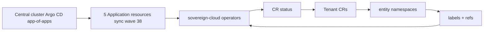

# Tenancy Ansible Operators

## Overview

Five **Ansible-based Kubernetes operators** manage tenancy-related custom resources on the **services cluster**:

| Operator | Responsibility (high level) |
|----------|----------------------------|
| **Team** | `Team` resources |
| **Assignment** | `Assignment` resources |
| **Project** | `Project` resources |
| **PlatformOpenshift** | `PlatformOpenshift` resources |
| **CloudOSO** | `CloudOSO` resources |

Together with the existing **entity operator**, they extend the `hybridsovereign.redhat` API surface used for hybrid sovereign tenancy.

All five operators:

- Use API group **`hybridsovereign.redhat`**, version **`v1alpha1`** for their CRDs and CR instances.
- Follow reconciliation driven by **namespace labels** / **referenced CRs** (Assignment), updating **`.status`** to reflect observed state.
- Run in the **`sovereign-cloud`** namespace on the **services cluster** (same footprint as other sovereign control-plane operators).
- Are deployed via the **central cluster Argo CD app-of-apps** (`helm/central`), each as its own **Argo CD Application** at **sync wave 38**.

## Chart / image versions

| Operator | Helm chart | Chart version | Operator image tag |
|----------|-------------|---------------|-------------------|
| Team | `team-operator` | **0.3.3** | **0.0.2** |
| Assignment | `assignment-operator` | **0.3.3** | **0.0.2** |
| Project | `project-operator` | **0.3.3** | **0.0.2** |
| PlatformOpenshift | `platformopenshift-operator` | **0.2.0** | **0.0.1** |
| CloudOSO | `cloudoso-operator` | **0.2.0** | **0.0.1** |

## Architecture Diagram

Central **Argo CD** declares **five** `Application` resources—each chart deploys onto the services cluster **`sovereign-cloud`** namespace. **Custom resources** live **in tenant / entity namespaces**; controllers **list/watch namespaces** (and, for Assignment, **peer CRs**), then **patch `.status`**.

## CRD quick reference

| CRD | Kind | Plural | Scope |
|-----|------|--------|-------|
| teams.hybridsovereign.redhat | Team | teams | Namespaced |
| assignments.hybridsovereign.redhat | Assignment | assignments | Namespaced |
| projects.hybridsovereign.redhat | Project | projects | Namespaced |
| platformopenshifts.hybridsovereign.redhat | PlatformOpenshift | platformopenshifts | Namespaced |
| cloudosos.hybridsovereign.redhat | CloudOSO | cloudosos | Namespaced |

## Team (`teams.hybridsovereign.redhat`)

### Spec fields

| Field | Description |
|-------|-------------|
| `features.istio` | Enable Istio for the team (`boolean`, default false) |
| `features.argo` | Enable Argo Workflows for the team (`boolean`, default false) |
| `rbacConfig` | Name of `RbacConfig` in `sovereign-cloud-plugins` for RBAC provisioning |
| `teamAdmin` | List of `Rbac` CR names acting as team admins |

### Status fields

| Field | Description |
|-------|-------------|
| `entity` | Entity from namespace labels |
| `billingId` | Billing ID from namespace labels |
| `features` | Mirrored `{ istio, argo }` |
| `rbacConfig` | Observed rbac config linkage |
| `teamAdmin` | Observed admin `Rbac` references |
| `ready` | Aggregate readiness |
| `conditions` | Standard conditions |

(OpenAPI schema also carries optional echoes such as `name`, `namespace`, `description`.)

### Printer columns

| Column | JSONPath |
|--------|----------|
| Entity | `.status.entity` |
| RbacConfig | `.status.rbacConfig` |
| Istio | `.status.features.istio` |
| Argo | `.status.features.argo` |
| Ready | `.status.ready` |
| Age | `.metadata.creationTimestamp` |

## Project (`projects.hybridsovereign.redhat`)

### Spec fields

| Field | Description |
|-------|-------------|
| `rbacConfig` | Name of `RbacConfig` in `sovereign-cloud-plugins` |
| `projectAdmin` | List of `Rbac` CR names acting as project admins |

### Status fields

| Field | Description |
|-------|-------------|
| `entity`, `billingId` | From namespace labels |
| `rbacConfig` | Observed config |
| `projectAdmin` | Observed admin refs |
| `ready` | Aggregate readiness |
| `conditions` | Standard conditions |

(Optional echoes: `name`, `namespace`, `description`.)

### Printer columns

| Column | JSONPath |
|--------|----------|
| Entity | `.status.entity` |
| RbacConfig | `.status.rbacConfig` |
| Ready | `.status.ready` |
| Age | `.metadata.creationTimestamp` |

## Assignment (`assignments.hybridsovereign.redhat`)

### Spec fields

| Field | Description |
|-------|-------------|
| `team` | Name of the `Team` CR |
| `projects` | Names of `Project` CRs assigned to the team |
| `openshift` | Names of `PlatformOpenshift` CRs where the team is placed |

### Status fields

| Field | Description |
|-------|-------------|
| `entity` | From namespace labels |
| `team` | Resolved team name |
| `teamReady` | Readiness of the referenced `Team` |
| `projects` | `{ name, ready }` per listed project |
| `openshift` | `{ name, ready }` per listed platform |
| `ready` | Assignment ready when linked objects report ready |
| `conditions` | Standard conditions |

(Additional OpenAPI echoes may include `billingId`, `name`, `namespace`, `description`.)

### Printer columns

| Column | JSONPath |
|--------|----------|
| Team | `.status.team` |
| Entity | `.status.entity` |
| Ready | `.status.ready` |
| Age | `.metadata.creationTimestamp` |

## PlatformOpenshift (`platformopenshifts.hybridsovereign.redhat`)

### Spec fields

_User-desired state is empty (no configurable spec fields)._ 

### Status fields

| Field | Description |
|-------|-------------|
| `entity`, `billingId` | From namespace metadata |
| `name` | Observed logical name |
| `ready` | Observed readiness |
| `conditions` | Standard conditions |

(Also `namespace`, `description` in schema.)

### Printer columns

| Column | JSONPath |
|--------|----------|
| Name | `.metadata.name` |
| Entity | `.status.entity` |
| Ready | `.status.ready` |
| Age | `.metadata.creationTimestamp` |

## CloudOSO (`cloudosos.hybridsovereign.redhat`)

### Spec fields

_User-desired state is empty._ 

### Status fields

| Field | Description |
|-------|-------------|
| `entity`, `billingId` | From namespace metadata |
| `name` | Observed logical name |
| `ready` | Observed readiness |
| `conditions` | Standard conditions |

(Also `namespace`, `description` in schema.)

### Printer columns

| Column | JSONPath |
|--------|----------|
| Name | `.metadata.name` |
| Entity | `.status.entity` |
| Ready | `.status.ready` |
| Age | `.metadata.creationTimestamp` |

## Related Documentation

- [Prometheus metrics and alerts](21-prometheus-metrics.md)
- [Platform secrets flow & sync-wave context](18-secrets-flow.md)
- Canonical operator deep-dive for implementers: [architecture docs — Tenancy operators](../../../../architecture/docs/technical/24-tenancy-operators.md)
