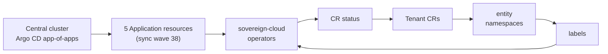

# Tenancy Ansible Operators

## Overview

Five new **Ansible-based Kubernetes operators** manage tenancy-related custom resources on the **services cluster**:

| Operator | Responsibility (high level) |
|----------|----------------------------|
| **Team** | `Team` resources |
| **Assignment** | `Assignment` resources |
| **Project** | `Project` resources |
| **PlatformOpenshift** | `PlatformOpenshift` resources |
| **CloudOSO** | `CloudOSO` resources |

Together with the existing **entity operator**, they extend the `hybridsovereign.redhat` API surface used for hybrid sovereign tenancy.

All five operators:

- Use API group **`hybridsovereign.redhat`**, version **`v1alpha1`** for their CRDs and CR instances.
- Follow **simple reconciliation**: read **namespace labels**, then **update CR `.status`** to reflect reconciled outcomes.
- Run in the **`sovereign-cloud`** namespace on the **services cluster** (same footprint as other sovereign control-plane operators).
- Are deployed via the **central cluster Argo CD app-of-apps** (`helm/central`), each as its own **Argo CD Application** at **sync wave 38**.

## Architecture Diagram

Central **Argo CD** (runs on the central cluster app-of-apps) declares **five Argo CD `Application`** resources—each chart deploys onto the services cluster **`sovereign-cloud`** namespace. **Custom resources** (`Team`, `Assignment`, …) are created **in tenant / entity namespaces**; controllers **list/watch namespaces**, read **`metadata.labels`**, then **patch `.status`** on the CR.

**Node count:** 7 graph vertices (< 15), covering GitOps orchestration → operator workloads → reconcile loop with entity namespaces.

## CRD Reference

All CRDs are **namespaced** (each CR lives in an entity or platform namespace alongside the workloads it describes).

| CRD | Kind | Plural | Scope |
|-----|------|--------|-------|
| teams.hybridsovereign.redhat | Team | teams | Namespaced |
| assignments.hybridsovereign.redhat | Assignment | assignments | Namespaced |
| projects.hybridsovereign.redhat | Project | projects | Namespaced |
| platformopenshifts.hybridsovereign.redhat | PlatformOpenshift | platformopenshifts | Namespaced |
| cloudosos.hybridsovereign.redhat | CloudOSO | cloudosos | Namespaced |

## Related Documentation

- [Prometheus metrics and alerts](21-prometheus-metrics.md)
- [Platform secrets flow & sync-wave context](18-secrets-flow.md)
